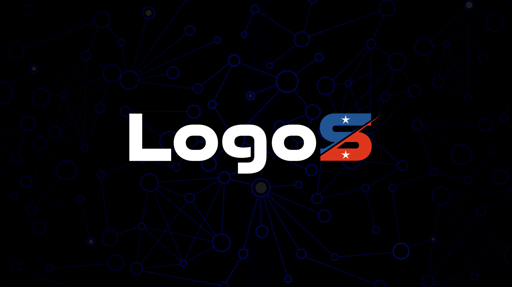
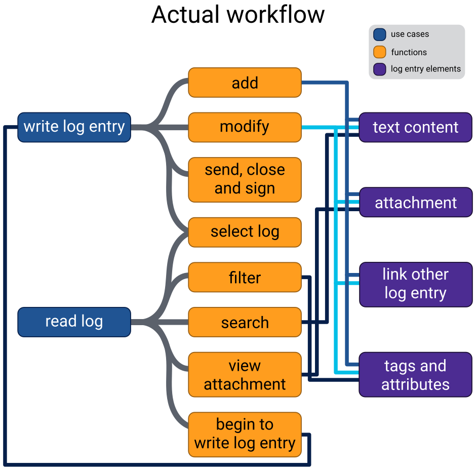

# LOGOS

## What is this?

Logos is a real-time cooperative logging and log management system with flexible access control, custom filtering and high security to provide better contribution, safer communication between the mission participants and data flow between humans and autonomous sensors or unmanned vehicles.

## How it works?

## Unique features

Features cover all of the potential considerations of the [NASA Space Apps Challenge 2021](https://2021.spaceappschallenge.org/challenges/statements/lunar-surface-operations-real-time-collaboration/details).

Unique features:
- expandable list of tags and attributes are already implemented
- log entries can handle data from autonomous sensors and unmanned vehicles
- multilingual user interface
- unique time range filtering for scientific research and post-mission operations
- the backend can work independently from the user interface
- server and client functionality in the same software to provide flexibility
- easy to start a new server in space or on other planet as well
- already fully supported programming languages: Python, PHP, SQL (skeleton only: C++ and JAVA)

## Future

### Widen the existing features

- overwriteable descriptions for log entries
- better and fancier UI

### New features

- lift-off based time system
- macros and hotkeys support
- predictive typing
- integrate 3rd party service (spellcheck, AI)
- handle any chain of command within the app

### Platform

- command line or terminal version
- more languages: C++, JAVA, javascript
- open an API for commercial space companies
- make a decentralized multi server workflow

### Other

- collaboration with NASA
- build this project to make it a daily used app

## Background

### Problem

- a lot of people are expected to follow the lunar surface EVAs or spacewalks
- EVAs crewmember will collect an enormous amount of data like photos, samples
- at the moment there is no real-time collaboration during console log writing
- providing two different kinds of use-cases at the same time: real-time or post-mission operations debriefs and scientific research

### Gains

#### astronaut and flight control

- real-time collaboration provides easier and faster log writing
- log entries can be filtered and sorted to provide focus on the most important entries

#### NASA (or any other space agencies)

- log entries can be linked to make better insights and reveal the connections
- log entries can handle data from autonomous sensors and unmanned vehicles
- real-time cooperation increases the productivity of crew members
- faster log processing saves time and money that can be spent on other missions

#### scientific community

- time range filtering narrows the data to the necessary entries by date and time
- real-time access to the data by the authorized users and researchers

#### world

- storing console log and attachment data in the same place makes easy access
- faster log processing results faster access to the official record of the mission
- a happy crew member means a happy earthling
